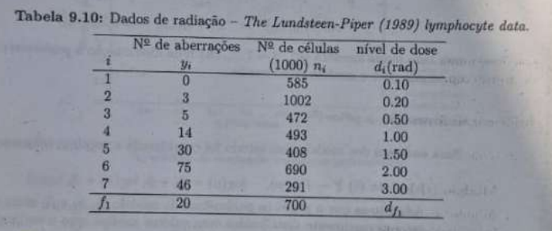
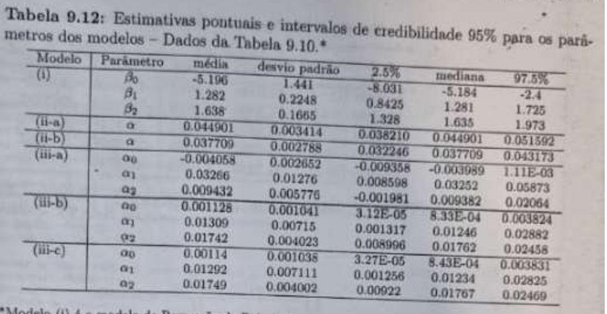
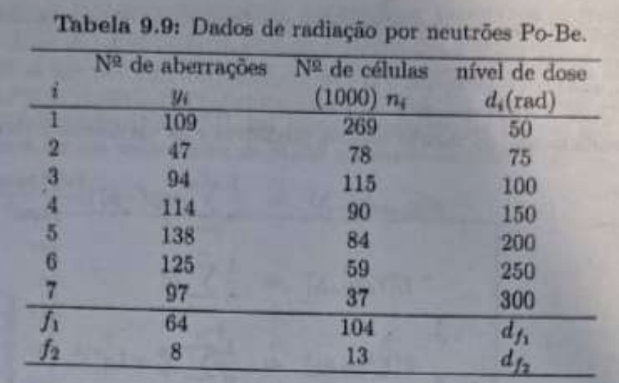
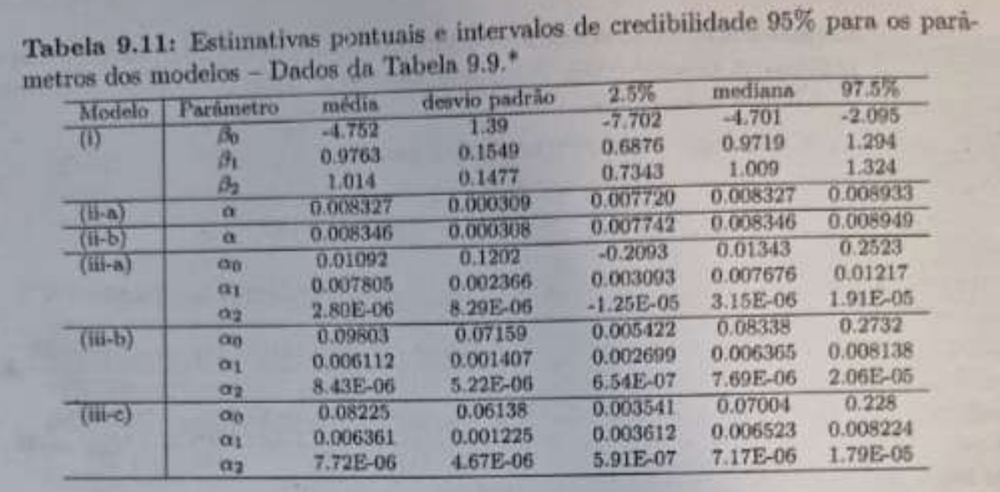

```{r setup, include=FALSE}

knitr::opts_chunk$set(echo = TRUE, warning = FALSE)
```

# Contexto

Calibração de doses de radiação - Regressão Poisson;

Dado problema apresentado queremos partir dos dados apresentados nas tabelas 9.9 e 9.10 e reproduzi-las com auxílio do OPENBUGS. A ideia é termos resultados aproximados aos das tabelas 9.11 e 9.12;

## Pré-requisitos

```{r}
# install.packages("R2OpenBUGS")
library(R2OpenBUGS)
# install.packages("knitr")
library(knitr)
# install.packages("kableExtra")
library(kableExtra)
# install.packages("dplyr")
library(dplyr)
```

# Dados 9.10

**_Tabela 9.10:_**



```{r}

# 1. Calibração (Tabela 9.10)
y_cal <- c(0, 3, 5, 14, 30, 75, 46)                  # Nº de aberrações
n_cal <- c(585, 1002, 472, 493, 408, 690, 291)       # Nº de células
d_cal <- c(0.10, 0.20, 0.50, 1.00, 1.50, 2.00, 3.00) # Nível de dose
m <- length(y_cal) # Número de observações de calibração

# 2. Indivíduo futuro (Linha 'f' da Tabela 9.10)
y_f <- 20  # Nº de aberrações observado
n_f <- 700 # Nº de células do futuro indivíduo

# Priori dos Betas ~ Normal(0, var=10000).
# BUGS usa PRECISÃO = 1/variância
prior_mean <- 0
prior_prec <- 1 / 10000

# 4. PREPARAR A LISTA DE DADOS PARA O OPENBUGS
bugs_data <- list(
  y = y_cal,
  n = n_cal,
  d = d_cal,
  m = m,
  yf = y_f,
  nf = n_f,
  b_mean = prior_mean,
  b_prec = prior_prec
)

# print(bugs_data)
```

# Modelo (i)

tentaremos replicar a primeira linha de resultados da Tabela 9.12: as estimativas para o Modelo(i).

Modelo (i): $Y\sim Poi(\mu)$ com $\log(\mu)=\beta_{0}+\beta_{1}\log(n)+\beta_{2}\log(d)$.

## Modelo OPENBUGS

Agora, criamos o arquivo de modelo. O texto o define como Modelo (i): $Y\sim Poi(\mu)$ com $\log(\mu)=\beta_{0}+\beta_{1}\log(n)+\beta_{2}\log(d)$.

portanto teremos um _model1.txt_ com o conteúdo:

\hrule

    # Modelo (i):
    model {
    # Verossimilhança ---
    for (i in 1:m) {
        # Modelo Poisson
        y[i] ~ dpois(mu[i])

        # Modelo de Regressão Log-linear
        log(mu[i]) <- beta0 + beta1 * log(n[i]) + beta2 * log(d[i])
    }

    # Priori dos Parâmetros de Regressão (Vagas) ---
    # Priori vaga conforme o texto (Normal com var=10000)
    beta0 ~ dnorm(b_mean, b_prec)
    beta1 ~ dnorm(b_mean, b_prec)
    beta2 ~ dnorm(b_mean, b_prec)

    # Indivíduo Futuro 'f' ---
    yf ~ dpois(muf)
    log(muf) <- beta0 + beta1 * log(nf) + beta2 * log(df) # df é desconhecido

    # df ~ Ga(10, 0.1)
    df ~ dgamma(df_a, df_b)
    }

\hrule

## Execução

```{r}
# Chutes Iniciais ---

inits <- function() {
  list(
    beta0 = 0,
    beta1 = 1,
    beta2 = 1,
    df    = 1
  )
}

# Parâmetros para retornar ---
retorno <- c("beta0", "beta1", "beta2")

model_run_1 <- bugs(
  data = bugs_data,
  inits = inits,
  parameters.to.save = retorno,
  model.file = "model1.txt",
  n.chains = 3,
  n.iter = 10000,
  n.burnin = 5000,
  n.thin = 5
)

print(model_run_1, digits = 3)
```

# Modelo (ii)

$Y \sim Poi(\mu)$ com $\mu = \alpha nd$

- Modelo (ii-a): Informação a priori vaga, com $a=b=0$.
- Modelo (ii-b): Informação a priori informativa, com $a=10$ e $b=1000$.

```{r}

# Usamos a aproximação MCMC padrão dgamma(0.001, 0.001)
bugs_data_2a <- bugs_data
bugs_data_2a$alpha_a <- 0.001
bugs_data_2a$alpha_b <- 0.001

# Modelo (ii-b) [Prior Informativa]
bugs_data_2b <- bugs_data
bugs_data_2b$alpha_a <- 10
bugs_data_2b$alpha_b <- 1000

```

## Modelo OPENBUGS

\hrule

    # Modelo (ii):
    model {
      # Verossimilhança ---
      for (i in 1:m) {
        y[i] ~ dpois(mu[i])
        mu[i] <- alpha * n[i] * d[i]
      }

      # Priori para Alpha ---
      # alpha ~ Ga(a, b)
      alpha ~ dgamma(alpha_a, alpha_b)

      # Indivíduo Futuro 'f'
      yf ~ dpois(muf)
      muf <- alpha * nf * df # df é desconhecido

      # Priori para df ~ Ga(10, 0.1)
      df ~ dgamma(df_a, df_b)
    }

\hrule

## Execução

```{r}
# Chutes iniciais
inits_2 <- function() {
  list(
    alpha = 1,
    df    = 1
  )
}

# Parâmetros ---
retorno_2 <- c("alpha")

# Modelo (ii-a) [Prior Vaga] ---
model_run_2a <- bugs(
  data = bugs_data_2a,
  inits = inits_2,
  parameters.to.save = retorno_2,
  model.file = "model2.txt",
  n.chains = 3,
  n.iter = 10000,
  n.burnin = 5000,
  n.thin = 5
)

# Modelo (ii-b) [Prior Informativa] ---

model_run_2b <- bugs(
  data = bugs_data_2b,
  inits = inits_2,
  parameters.to.save = retorno_2,
  model.file = "model2.txt",
  n.chains = 3,
  n.iter = 10000,
  n.burnin = 5000,
  n.thin = 5
)
```

### Modelo (ii-a) [Prior Vaga]

```{r}
print(model_run_2a, digits = 6)
```

### Modelo (ii-b) [Prior Informativa]

```{r}
print(model_run_2b, digits = 6)
```

#  Modelo (iii)

A definição do modelo é $Y \sim Poi(\mu)$ com $\mu = n(\alpha_0 + \alpha_1 d + \alpha_2 d^2)$


Vamos replicar:

- Modelo: (iii-a): $\alpha_0, \alpha_1, \alpha_2 \sim N(0, 10000)$.

- Modelo (iii-b): $\alpha_0, \alpha_1, \alpha_2 \sim Ga(1, 1)$.

- Modelo (iii-c): $\alpha_0, \alpha_1, \alpha_2 \sim Ga(1, 4)$.

```{r}

# Preparar dados para o Modelo (iii-a) [Prior N(0, 1000)]
bugs_data_3a <- bugs_data
bugs_data_3a$alpha_a <- 0
bugs_data_3a$alpha_b <- 1 / 10000

# Preparar dados para o Modelo (iii-b) [Prior Ga(1, 1)]
bugs_data_3b <- bugs_data
bugs_data_3b$alpha_a <- 1.0
bugs_data_3b$alpha_b <- 1.0

# Preparar dados para o Modelo (iii-c) [Prior Ga(1, 4)]
bugs_data_3c <- bugs_data
bugs_data_3c$alpha_a <- 1.0
bugs_data_3c$alpha_b <- 4.0
```

## Modelo OPENBUGS Normal

\hrule

    # Modelo (iii-a):
    model {
      for (i in 1:m) {
        y[i] ~ dpois(mu[i])
        mu[i] <- n[i] * (alpha0 + alpha1 * d[i] + alpha2 * pow(d[i], 2))
      }

      alpha0 ~ dnorm(b_mean, b_prec)
      alpha1 ~ dnorm(b_mean, b_prec)
      alpha2 ~ dnorm(b_mean, b_prec)
    }

\hrule

## Modelo OPENBUGS Gamma

\hrule

    # Modelo (iii-b/c):
    model {
      for (i in 1:m) {
        y[i] ~ dpois(mu[i])
        mu[i] <- n[i] * (alpha0 + alpha1 * d[i] + alpha2 * pow(d[i], 2))
      }

      alpha0 ~ dgamma(alpha_a, alpha_b)
      alpha1 ~ dgamma(alpha_a, alpha_b)
      alpha2 ~ dgamma(alpha_a, alpha_b)
    }

\hrule

## Execução

```{r}

# Chutes iniciais
inits_3 <- function() {
  list(
    alpha0 = 1,
    alpha1 = 2,
    alpha2 = 3
  )
}
retorno_3 <- c("alpha0", "alpha1", "alpha2")

model_run_3a <- bugs(
  data = bugs_data_3a,
  inits = inits_3,
  parameters.to.save = retorno_3,
  model.file = "model3_norm.txt",
  n.chains = 3,
  n.iter = 10000,
  n.burnin = 5000,
  n.thin = 5
)

# Executar o Modelo (iii-c) [Prior Ga(1, 1)] ---
model_run_3b <- bugs(
  data = bugs_data_3b,
  inits = inits_3,
  parameters.to.save = retorno_3,
  model.file = "model3_gamma.txt",
  n.chains = 3,
  n.iter = 10000,
  n.burnin = 5000,
  n.thin = 5
)

# Executar o Modelo (iii-c) [Prior Ga(1, 4)] ---

model_run_3c <- bugs(
  data = bugs_data_3c,
  inits = inits_3,
  parameters.to.save = retorno_3,
  model.file = "model3_gamma.txt",
  n.chains = 3,
  n.iter = 10000,
  n.burnin = 5000,
  n.thin = 5
)
```

### Modelo (iii-a) [Prior N(0, 10000)]

```{r}
print(model_run_3a, digits = 7)
```

### Modelo (iii-b) [Prior Ga(1, 1)]

```{r}
print(model_run_3b, digits = 7)
```

### Modelo (iii-c) [Prior Ga(1, 4)]

```{r}
print(model_run_3c, digits = 7)
```

## Comparando as tabelas
```{r}

extract_summary <- function(model_run, model_name) {

  summary_df <- as.data.frame(model_run$summary)
  summary_df$Parametro <- rownames(model_run$summary)
  summary_df$Modelo <- model_name
  summary_df <- subset(summary_df, Parametro != "deviance")
  summary_df <- summary_df %>%
    select(
      Modelo,
      "Parâmetro" = Parametro,
      "média" = mean,
      "desvio padrão" = sd,
      "2.5%" = `2.5%`,
      Mediana = `50%`,
      "97.5%" = `97.5%`
    )

  return(summary_df)
}

tabela_m1 <- extract_summary(model_run_1,   "(i)")
tabela_m2a <- extract_summary(model_run_2a, "(ii-a)")
tabela_m2b <- extract_summary(model_run_2b, "(ii-b)")
tabela_m3a <- extract_summary(model_run_3a, "(iii-a)")
tabela_m3b <- extract_summary(model_run_3b, "(iii-b)")
tabela_m3c <- extract_summary(model_run_3c, "(iii-c)")

tabela_resumo_final <- bind_rows(
  tabela_m1,
  tabela_m2a,
  tabela_m2b,
  tabela_m3a,
  tabela_m3b,
  tabela_m3c
)

kable(tabela_resumo_final, booktabs = TRUE , row.names = FALSE) %>%
  kable_styling(latex_options = "hold_position") %>%
  collapse_rows(columns = 1, valign = "middle", latex_hline = "major")
```

**_Tabela 9.12:_**




# Dados 9.9

Os princípios e modelos são exatamente os mesmos do anterior então faremos de forma mais direta:

**_Tabela 9.9:_**



```{r}

# Dados de calibração (i=1...7)
y_cal_T9 <- c(109, 47, 94, 114, 138, 125, 97)
n_cal_T9 <- c(269, 78, 115, 90, 84, 59, 37)
d_cal_T9 <- c(50, 75, 100, 150, 200, 250, 300)
m_T9 <- length(y_cal_T9)

# Priori vaga (Normal)
prior_mean <- 0.0
prior_prec <- 1.0 / 10000.0

# Lista de dados base (apenas m=7 dados)
bugs_data_T9_base <- list(
  y = y_cal_T9,
  n = n_cal_T9,
  d = d_cal_T9,
  m = m_T9,
  b_mean = prior_mean,
  b_prec = prior_prec
)

n_iter   <- 10000
n_burn   <- 5000
n_thin   <- 5
n_chains <- 3

lista_resumos_T9 <- list()

## Executar Modelos ---

# Modelo (i)

params_1 <- c("beta0", "beta1", "beta2")
inits_1 <- function() list(beta0 = 0, beta1 = 1, beta2 = 1)

run_m1 <- bugs(
  data = bugs_data_T9_base,
  inits = inits_1,
  parameters.to.save = params_1,
  model.file = "model1.txt",
  n.chains = n_chains,
  n.iter = n_iter,
  n.burnin = n_burn,
  n.thin = n_thin
)

lista_resumos_T9$m1 <- extract_summary(run_m1, "(i)")

# Modelo (ii)
params_2 <- c("alpha")
inits_2 <- function() list(alpha = 0.01)
data_2a <- bugs_data_T9_base
data_2a$alpha_a <- 0.001
data_2a$alpha_b <- 0.001
run_m2a <- bugs(
  data = data_2a,
  inits = inits_2,
  parameters.to.save = params_2,
  model.file = "model2.txt",
  n.chains = n_chains,
  n.iter = n_iter,
  n.burnin = n_burn,
  n.thin = n_thin
)

lista_resumos_T9$m2a <- extract_summary(run_m2a, "(ii-a)")

# Modelo (ii-b)
data_2b         <- bugs_data_T9_base
data_2b$alpha_a <- 10.0
data_2b$alpha_b <- 1000.0
run_m2b <- bugs(
  data = data_2b,
  inits = inits_2,
  parameters.to.save = params_2,
  model.file = "model2.txt",
  n.chains = n_chains,
  n.iter = n_iter,
  n.burnin = n_burn,
  n.thin = n_thin
)

lista_resumos_T9$m2b <- extract_summary(run_m2b, "(ii-b)")

# Modelo (iii-a)
params_3 <- c("alpha0", "alpha1", "alpha2")
inits_3 <- function() list(alpha0 = 0.01, alpha1 = 0.01, alpha2 = 0.00001)
run_m3a <- bugs(
  data = bugs_data_T9_base,
  inits = inits_3,
  parameters.to.save = params_3,
  model.file = "model3_norm.txt",
  n.chains = n_chains,
  n.iter = n_iter,
  n.burnin = n_burn,
  n.thin = n_thin
)
lista_resumos_T9$m3a <- extract_summary(run_m3a, "(iii-a)")

# Modelo (iii-b)

data_3b <- bugs_data_T9_base
data_3b$alpha_a <- 1.0
data_3b$alpha_b <- 1.0
run_m3b <- bugs(
  data = data_3b,
  inits = inits_3,
  parameters.to.save = params_3,
  model.file = "model3_gamma.txt",
  n.chains = n_chains,
  n.iter = n_iter,
  n.burnin = n_burn,
  n.thin = n_thin
)
lista_resumos_T9$m3b <- extract_summary(run_m3b, "(iii-b)")

# Modelo (iii-c)
data_3c <- bugs_data_T9_base
data_3c$alpha_a <- 1.0
data_3c$alpha_b <- 4.0
run_m3c <- bugs(
  data = data_3c,
  inits = inits_3,
  parameters.to.save = params_3,
  model.file = "model3_gamma.txt",
  n.chains = n_chains,
  n.iter = n_iter,
  n.burnin = n_burn,
  n.thin = n_thin
)

lista_resumos_T9$m3c <- extract_summary(run_m3c, "(iii-c)")

tabela_resumo_T9 <- bind_rows(lista_resumos_T9)

kable(tabela_resumo_T9, booktabs = TRUE , row.names = FALSE) %>%
  kable_styling(latex_options = "hold_position") %>%
  collapse_rows(columns = 1, valign = "middle", latex_hline = "major")
```

**_Tabela 9.11:_**




Com exceção do modelo (iii-a) com os dados da tabela 9.10, podemos considerar que houve sucesso na reprodução das tabelas apresentadas pelo livro.
